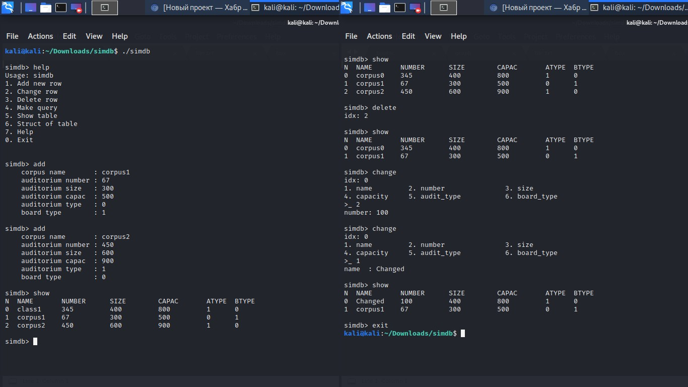

### simdb
  According to Wiki:  
> Database is an organized collection of data, generally stored and accessed electronically from a computer system  

  The main idea is keep, manipulate and modify data using just couple lines of code. My db is local, educational and simple (where name comes from). It was my university project and decided to make it litle bit more complex than it had to be. There a lot of modifications that U can add. Feel free to practice with it.

***Prj preview***  
dev    - read/write into file  
input  - read data typed by user  
output - write data to console (has some outlook option)  
engine - where magic happens. All functions suplyed by `simdb` are there  
query  - perform simple filter query  

  
***TODO***
* GUI written in tkinter
* Command for creating specified table (currently has just one)
* More u-test

  
***Build and run*** 
I'm NOT superuser in C or Linux world. That's why my prjs are simple and use minimal amount of tools and dependencies. Currentky they are `make`, `Python3`  

U can either build project and use it as console tool
> make 

Make it shared library and use it code from Python code in `gui/gui.py`
> make lib.so

***Explanations*** 
Check out `expl` folder for further reading and explnation.

  
***Notes***  
If you have no Unix-like system or you couldn't run prj in your PC then U can checkout and run it on https://repl.it/@MrVirm. I hope U'll find that project usefull for you, my reader.  

